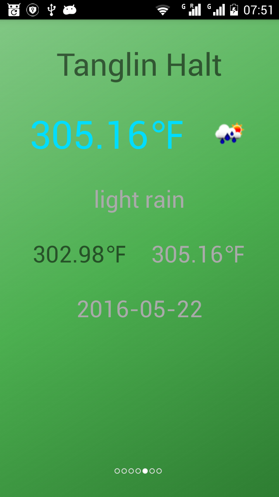

# AWeather
Weather demo for android

Use RxAndroid, okHttp3, Retrofit2, Gson, RxLifecycle, Butterknife, Picasso, Google location

The main specialty is that there is a Core library.
The UI developer donot need to know the Core library, just use the CoreHelper.java, and CoreResponse.java to get data.

